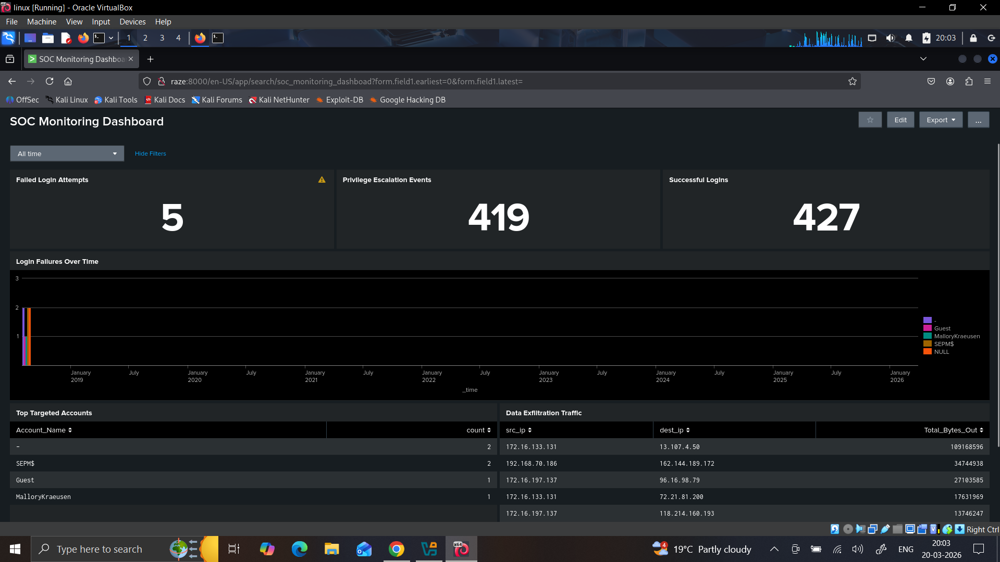
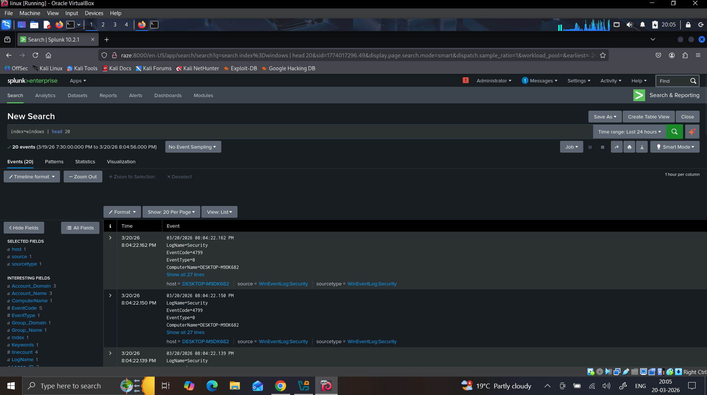
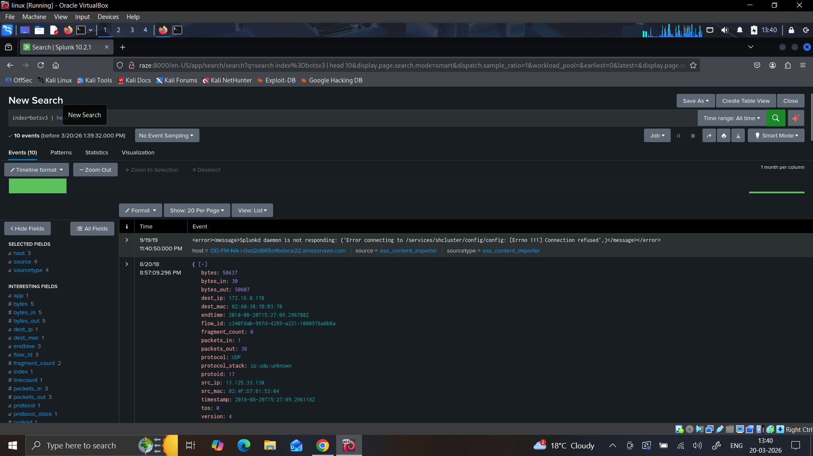
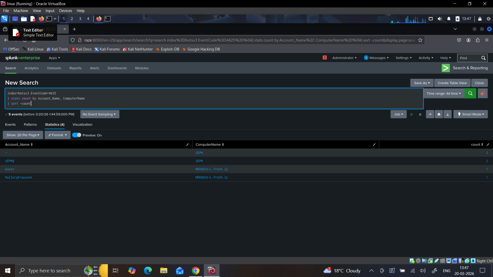
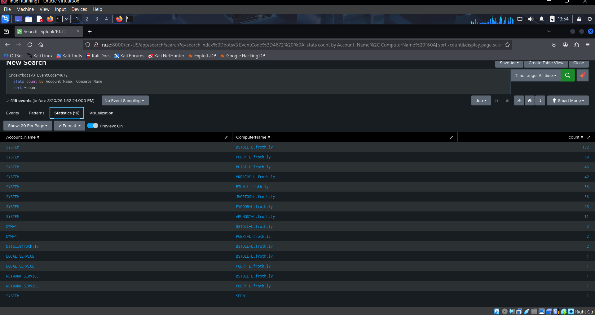
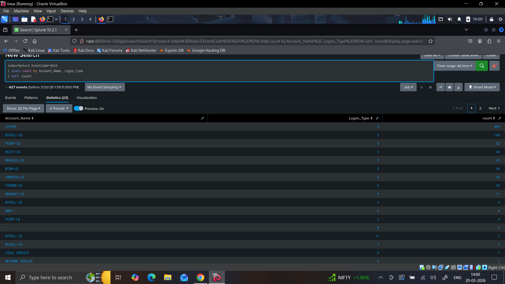
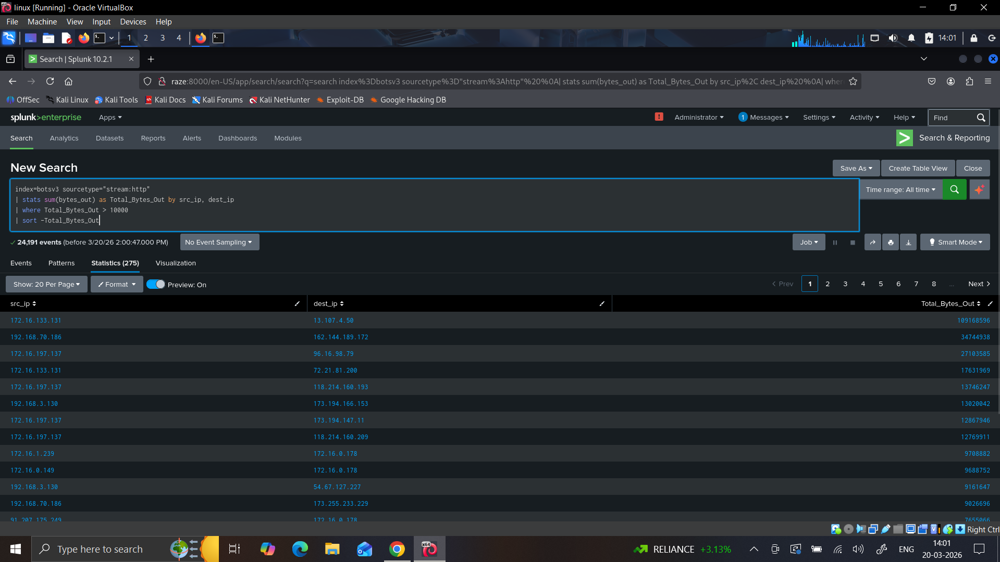
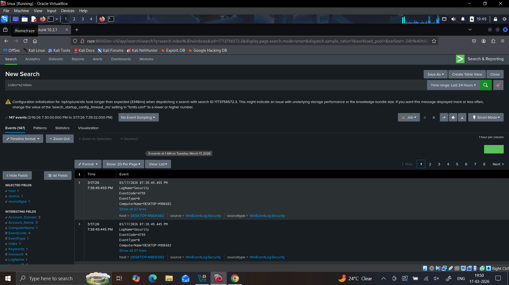

# 🔍 Splunk SIEM Home Lab — Threat Detection & Security Monitoring


---

## 📌 Project Overview

Built a fully functional **Security Information and Event Management (SIEM)** home lab using Splunk Enterprise to simulate a real SOC environment. The lab ingests live Windows endpoint logs and analyses real attack data from Splunk's BOTS v3 dataset to detect threats mapped to the MITRE ATT&CK framework.

---

## 🏗️ Lab Architecture

```
Windows 10 (Host OS)          Kali Linux (VMware)
─────────────────────         ───────────────────
Sysmon v15.15             →   Splunk Enterprise 10.2.1
Universal Forwarder           Indexes & Analyses logs
Generates live logs           Web UI on port 8000
        │
        └──── TCP port 9997 ──────────┘

BOTS v3 Dataset ──────────────→ index=botsv3
```

---

## 🛠️ Tools Used

| Tool | Purpose |
|------|---------|
| Splunk Enterprise 10.2.1 | SIEM platform |
| Sysmon v15.15 | Endpoint telemetry |
| Splunk Universal Forwarder | Log forwarding |
| BOTS v3 Dataset | Attack simulation data |
| Kali Linux | SIEM server |
| Windows 10 | Target endpoint |
| VMware | Virtualisation |
| MITRE ATT&CK | Detection mapping |
| SwiftOnSecurity Config | Sysmon tuning |

---

## 📥 Log Sources Ingested

| Log Source | Index | Purpose |
|------------|-------|---------|
| Windows Security Event Log | windows | Login events, account changes |
| Windows System Event Log | windows | Service and system events |
| Windows Application Event Log | windows | Application activity |
| Sysmon Operational Log | windows | Process, network, file events |
| BOTS v3 Attack Dataset | botsv3 | Real world attack simulation |

---

## 🔍 Detection Use Cases

### 1. Brute Force Detection — MITRE T1110

**EventCode 4625** = Failed Logon

```spl
index=botsv3 EventCode=4625
| stats count by Account_Name, ComputerName
| sort -count
| rename count as "Failed_Login_Attempts"
```

**Findings:** Guest, MalloryKraeusen, SEPM$ targeted — **5 events detected**

---

### 2. Privilege Escalation Detection — MITRE T1078

**EventCode 4672** = Special Privileges Assigned

```spl
index=botsv3 EventCode=4672
| stats count by Account_Name, ComputerName
| sort -count
```

**Findings:** SYSTEM with 162 events, suspicious user bstollefroth.ly — **419 events detected**

---

### 3. Lateral Movement Detection — MITRE T1021

**EventCode 4624** = Successful Logon + Network Logon Type

```spl
index=botsv3 EventCode=4624
| stats count by Account_Name, Logon_Type
| sort -count
```

**Findings:** SYSTEM 409 logons, BSTOLL-L$ 164 logons — **427 events detected**

---

### 4. Data Exfiltration Detection — MITRE T1041

**sourcetype stream:http** = Network traffic analysis

```spl
index=botsv3 sourcetype="stream:http"
| stats sum(bytes_out) as Total_Bytes_Out by src_ip, dest_ip
| where Total_Bytes_Out > 10000
| sort -Total_Bytes_Out
```

**Findings:** 172.16.133.131 sent 109MB to external IP — **24,191 events detected**

---

## 📊 SOC Monitoring Dashboard

6-panel live dashboard built in Splunk:

| Panel | Result |
|-------|--------|
| Failed Login Attempts | 5 |
| Privilege Escalation Events | 419 |
| Successful Logins | 427 |
| Login Failures Over Time | Chart 2019-2026 |
| Top Targeted Accounts | Guest, MalloryKraeusen, SEPM$ |
| Data Exfiltration Traffic | 109MB+ transfers detected |

---

## 📸 Screenshots

### Splunk Home Dashboard


### Windows Logs Ingestion


### BOTS v3 Dataset Loaded


### Brute Force Detection — MITRE T1110


### Privilege Escalation Detection — MITRE T1078


### Lateral Movement Detection — MITRE T1021


### Data Exfiltration Detection — MITRE T1041


### SOC Monitoring Dashboard


---

## ⚙️ Setup Guide

### Part 1 — Splunk on Kali Linux

```bash
wget -4 --tries=3 -O splunk.deb "https://download.splunk.com/..."
sudo dpkg -i splunk.deb
sudo /opt/splunk/bin/splunk start --accept-license --run-as-root
sudo /opt/splunk/bin/splunk enable boot-start --run-as-root -user root
sudo ufw allow 8000 && sudo ufw allow 9997 && sudo ufw enable
sudo /opt/splunk/bin/splunk enable listen 9997 -auth admin:PASSWORD --run-as-root
sudo /opt/splunk/bin/splunk add index windows -auth admin:PASSWORD --run-as-root
```

### Part 2 — Sysmon on Windows 10

```powershell
.\Sysmon64.exe -accepteula -i sysmonconfig-export.xml
```

### Part 3 — inputs.conf

```ini
[WinEventLog://Security]
index = windows
disabled = false

[WinEventLog://System]
index = windows
disabled = false

[WinEventLog://Application]
index = windows
disabled = false

[WinEventLog://Microsoft-Windows-Sysmon/Operational]
index = windows
disabled = false
renderXml = true
```

### Part 4 — BOTS v3 Dataset

```bash
wget -4 -O botsv3.tgz "https://botsdataset.s3.amazonaws.com/botsv3/botsv3_data_set.tgz"
sudo tar -xvzf botsv3.tgz -C /opt/splunk/etc/apps/
sudo /opt/splunk/bin/splunk restart --run-as-root
```

---

## 🎯 Skills Demonstrated

- SIEM deployment and administration
- Log ingestion and parsing
- SPL query writing
- MITRE ATT&CK detection mapping
- SOC dashboard building
- Threat analysis using real attack data
- Sysmon endpoint monitoring
- Linux administration
- Network security and firewall configuration

---

## 📋 Project Stats

```
Windows logs ingested:       147+ real events
BOTS attack events:          24,000+
Detection use cases:         4
SPL queries written:         10+
MITRE techniques covered:    T1110, T1078, T1021, T1041
Dashboard panels:            6
```

---

## 🔗 Connect

**LinkedIn:** [linkedin.com/in/lucky-sharma-923523341](https://linkedin.com/in/lucky-sharma-923523341)

**GitHub:** [github.com/sharmalucky10](https://github.com/sharmalucky10)

---

*Built as part of SOC Analyst portfolio — March 2026*
